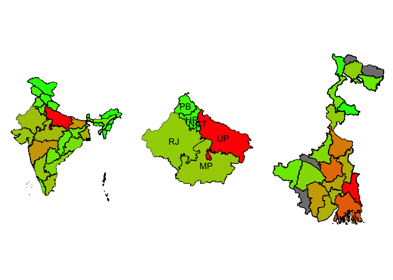

<!-- README.md is generated from README.Rmd. Please edit that file -->

# indiamap

<!-- badges: start -->

[](https://github.com/shubhamdutta26/indiamap/actions/workflows/R-CMD-check.yaml)
[](https://app.codecov.io/gh/shubhamdutta26/indiamap)
<!-- badges: end -->

## indiamap

    #> Warning in st_point_on_surface.sfc(sf::st_zm(x)): st_point_on_surface may not
    #> give correct results for longitude/latitude data



## Installation

You can install the development version of indiamap from
[GitHub](https://github.com/) with:

``` r
# install.packages("pak")
pak::pak("shubhamdutta26/indiamap")
```
